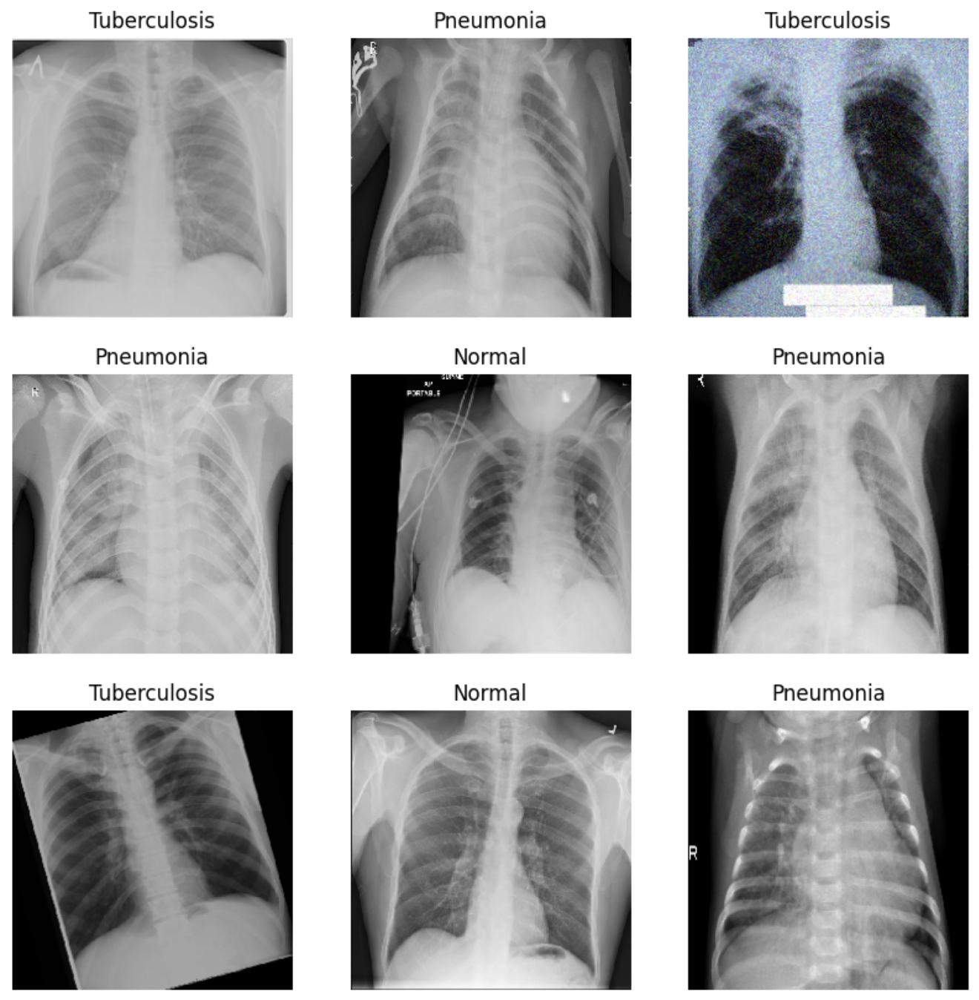
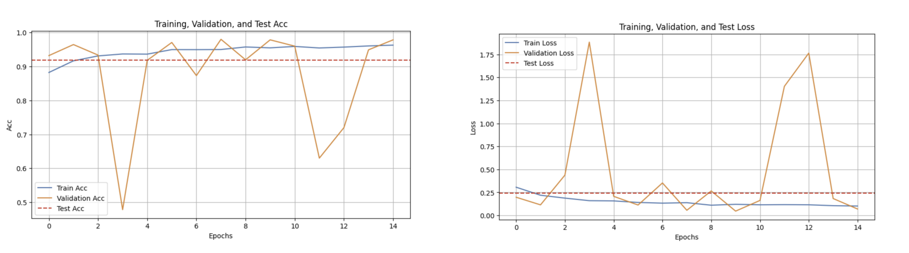
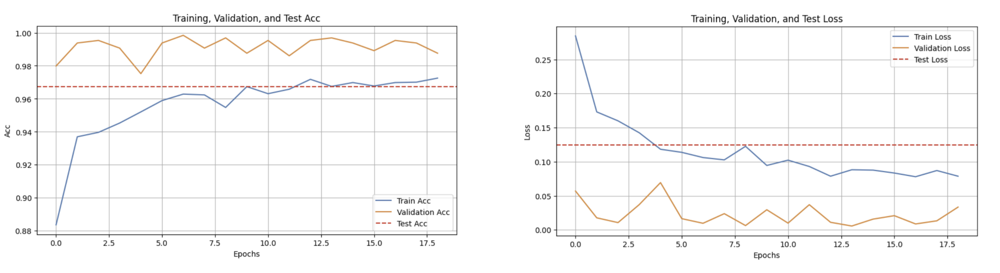
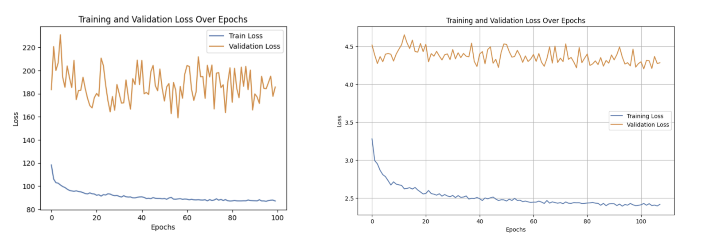
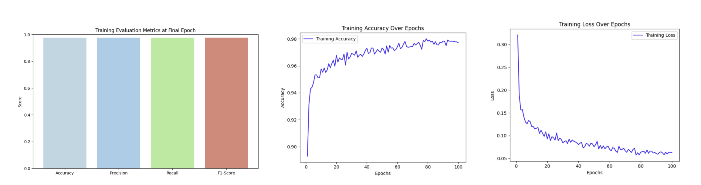
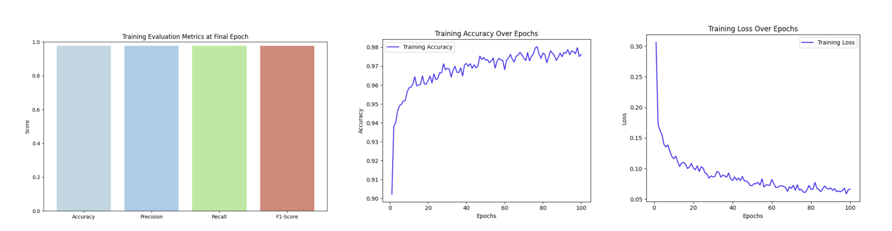
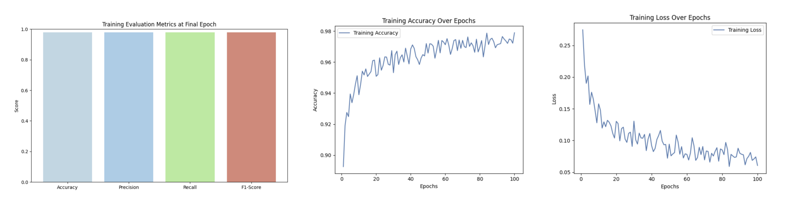
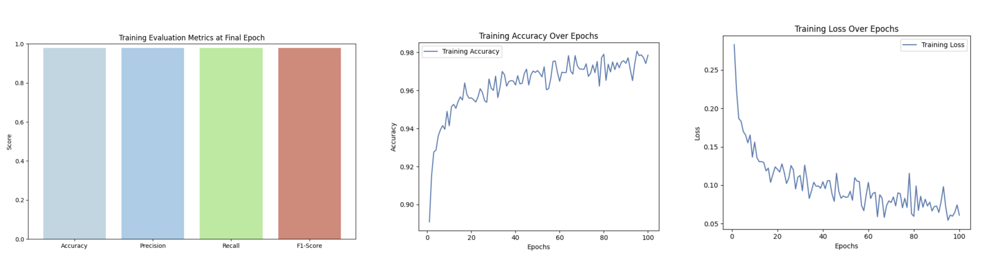

# ssl-for-chest-x-ray
Implementation of supervised learning and self-supervised learning algorithms on chest-xray diseases pictures and comparing their performance

### Datasets Links:
   - **Tuberculosis Chest X-ray Dataset**: [Link](https://www.kaggle.com/datasets/tawsifurrahman/tuberculosis-tb-chest-xray-dataset/data)
   - **Pneumonia Chest X-ray Dataset**: [Link](https://www.kaggle.com/paultimothymooney/chest-xray-pneumonia)

### Step-by-Step Explanation of the Project

1. **Dataset Collection:**
   - Two datasets were used for this project: **Chest X-ray Tuberculosis Dataset** and **Pneumonia Chest X-ray Dataset**.
   - The TB dataset contains 3,500 X-ray images (700 positive for tuberculosis and the rest normal), while the Pneumonia dataset contains 5,863 X-ray images categorized into normal and pneumonia cases.

2. **Preprocessing:**
   - The datasets were combined into one unified dataset with three categories: **NORMAL**, **TUBERCULOSIS**, and **PNEUMONIA**.
     
      
      
   - Images were resized, renamed, and structured into separate folders for **Training**, **Validation**, and **Testing** with a 70-15-15 split.

3. **Handling Data Imbalance:**
   - The dataset had imbalanced classes, with more normal images than tuberculosis or pneumonia cases.
   - To address this, techniques such as **Weighted Sampling** were applied, where more importance was given to minority classes to ensure balanced training.

4. **Supervised Learning Models with Transfer Learning:**
   - The project utilized **Transfer Learning** by using pre-trained models like **VGG16** and **ResNet50**.
   - These models were fine-tuned on the dataset, leveraging pre-learned features from large datasets like **ImageNet** to speed up training and improve accuracy.
   - These models were trained to classify X-ray images into three categories: **Normal**, **Tuberculosis**, and **Pneumonia**.

5. **Self-Supervised Learning:**
   - After supervised learning, self-supervised learning methods, including **SimCLR** and **Barlow Twins**, were implemented.
   - These models learn from unlabeled data by generating representations of the images and finding patterns in the data without requiring explicit labels.

6. **Model Evaluation:**
   - Both supervised (with transfer learning) and self-supervised models were tested for performance, including accuracy, recall, precision, and F1-score.
   - The models were also compared based on computational efficiency and the reduction of training time.
7.  **Conclusion:**
   - The self-supervised learning models provided comparable or better performance than supervised models, especially in cases where labeled data were scarce.
   - Transfer learning significantly reduced the training time and improved the performance of the models by utilizing pre-trained networks.
   - These techniques reduced the dependency on labeled datasets, improving the model's ability to generalize to new, unseen data.

## Results

### Model 1: ResNet50

*Figure 1: ResNet50 - Training, Validation, and Test Accuracy across epochs.*

*Figure 2: ResNet50 - Training, Validation, and Test Loss across epochs.*

---

### Model 2: VGG16

*Figure 3: VGG16 - Training, Validation, and Test Accuracy across epochs.*

*Figure 4: VGG16 - Training, Validation, and Test Loss across epochs.*

---
### SSL Training

*Figure 5: Training Loss for Barlow Twins.*

*Figure 6: Training Loss for SimClr.*

---
### Model 3: SimCLR (Encoder: ResNet50)

#### Fixed Encoder

*Figure 7: Training evaluation metrics in the final epoch*

*Figure 8: SimCLR with Fixed Encoder - Training, Validation, and Test Accuracy.*

*Figure 9: SimCLR with Fixed Encoder - Training, Validation, and Test Loss.*

#### Unfixed Encoder

*Figure 10: Training evaluation metrics in the final epoch*

*Figure 11: SimCLR with Unfixed Encoder - Training, Validation, and Test Accuracy.*

*Figure 12: SimCLR with Unfixed Encoder - Training, Validation, and Test Accuracy.*

---

### Model 4: Barlow Twins (Encoder: ResNet50)

#### Fixed Encoder

*Figure 13: Training evaluation metrics in the final epoch*

*Figure 14: Barlow Twins with Fixed Encoder - Training, Validation, and Test Accuracy.*

*Figure 15: Barlow Twins with Fixed Encoder - Training, Validation, and Test Loss.*

#### Unfixed Encoder

*Figure 16: Training evaluation metrics in the final epoch*

*Figure 17: Barlow Twins with Unfixed Encoder - Training, Validation, and Test Accuracy.*

*Figure 18: Barlow Twins with Unfixed Encoder - Training, Validation, and Test Loss.*
